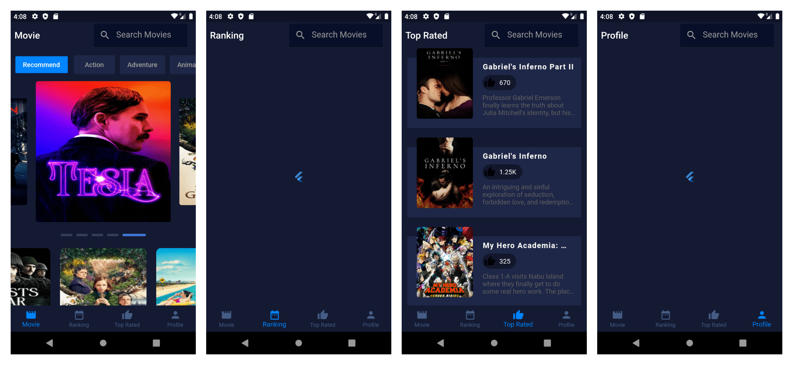

# Overview

I hope you enjoy it :)  
Learning how to implement UI from Dribble and API is from TheMovieDB :smile:
 
Source for Design Inspiration is From Dribble  
Link    : [His Dribble](https://dribbble.com/shots/4828362-Movie-app)  
 

## Screenshot

